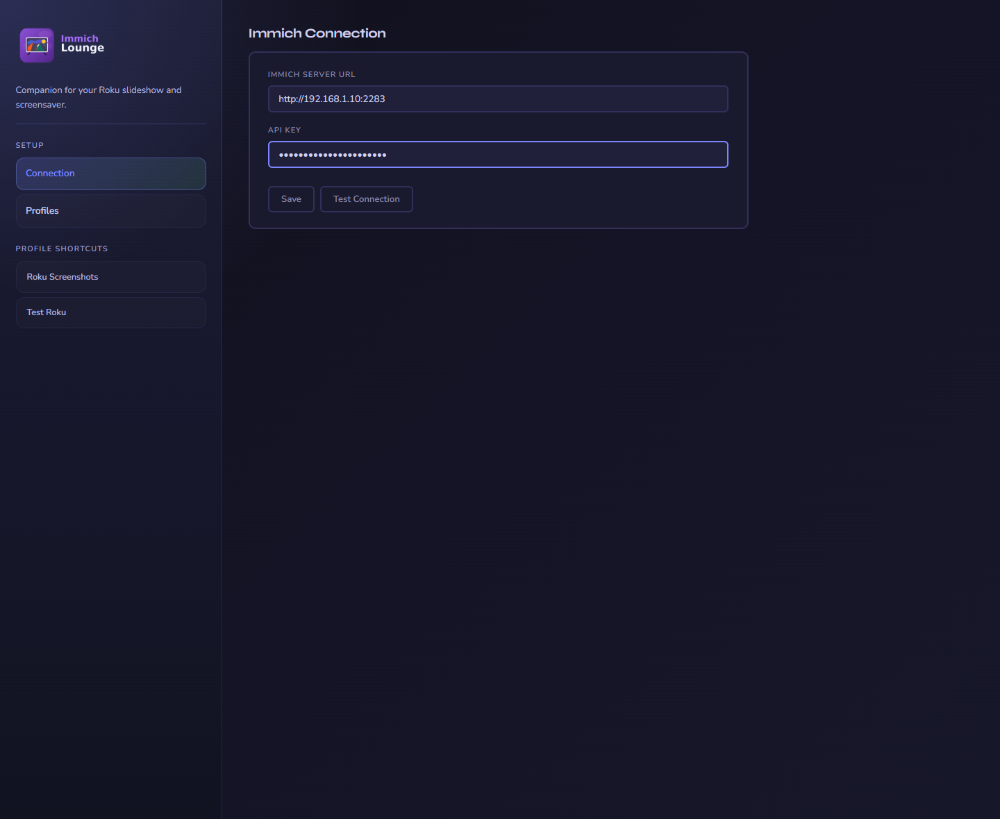
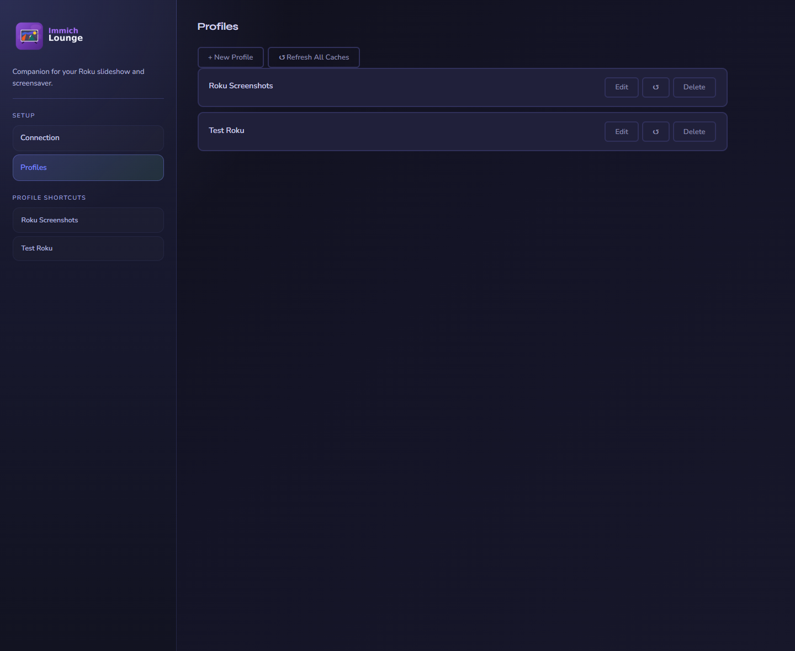
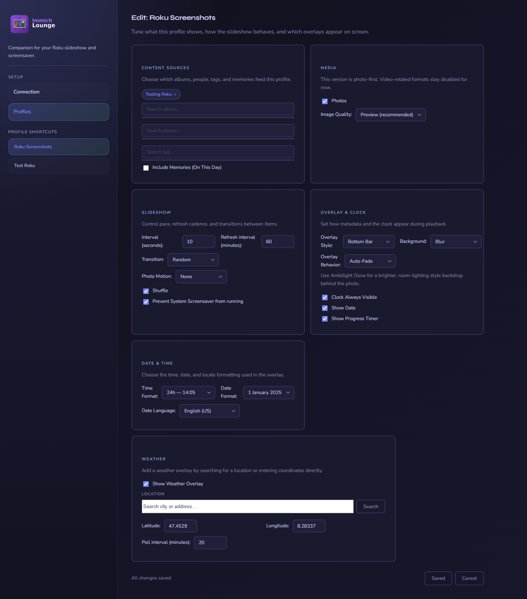

# Using the Companion

This page covers the day-to-day companion web app after the initial connection to immich is already set up.

For install and first-run setup, see [Getting Started](./getting-started.md) and [Installation](./installation.md).

## Connection page

The Connection page stores the shared immich connection used by every profile.

Use it when you need to:

- change the friendly name shown in the UI
- update the immich server URL
- replace the API key
- verify access with **Test Connection**

{ .doc-screenshot }

The connection page is the one shared integration point between the companion and immich.

## Profiles page

The Profiles page is the main hub for ongoing changes.

Use it when you want to:

- create a new profile for a room, use case, or screensaver
- edit an existing profile
- remove a profile you no longer need
- compare which profiles exist before switching the Roku to a different one

{ .doc-screenshot }

Profiles are where most day-to-day tuning happens after setup is complete.

## Profile editor

Each profile controls both what the Roku shows and how playback should feel.

| Area | What you manage there |
|---|---|
| Content | Albums, people, tags, memories, and optional date filters |
| Playback | Interval, shuffle, transitions, photo motion, and refresh timing |
| Display | Overlay style, fields, background effects, date formatting, weather, and image quality |

{ .doc-screenshot }

The profile editor combines content selection, playback settings, and visual tuning in one place.

## Typical companion tasks

- make one profile for the main channel and another for the screensaver
- keep a simpler profile for weaker Roku hardware or slower networks
- duplicate a working setup by recreating a similar profile with different albums or people
- update the immich API key in one place when it changes

## What the companion does not do

- it does not proxy image delivery
- it does not store the API key inside the profile JSON files on disk
- it does not control Roku-side cache clearing or profile switching directly

For Roku playback behavior, remote controls, and the on-device settings menu, see [Using the Roku Apps](./roku-apps.md).
