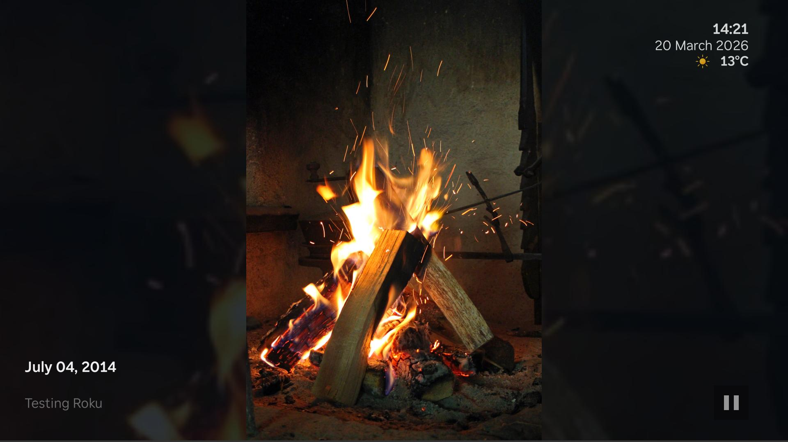
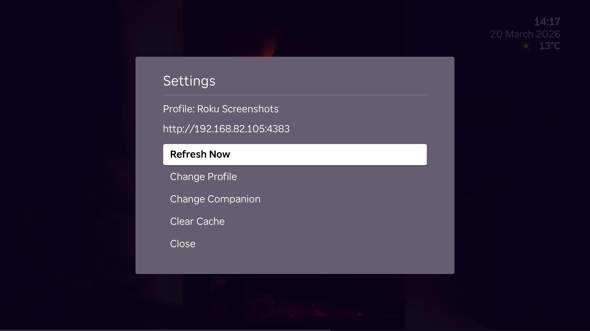

# Configuration

Most users only need three things here: connect the companion to immich, create one or more profiles, and tune how the slideshow should look on Roku.

## Connection settings

These settings are shared by every profile:

- friendly name
- immich server URL
- immich API key

After saving, use **Test Connection** to make sure the companion can reach immich.

{ .doc-screenshot }

The connection page stores the single immich connection used by all profiles.

> **Security note:** The companion is for trusted home networks. It does not provide public-internet authentication.

## Profiles

A profile decides what to show and how to show it. You can create as many as you want.

{ .doc-screenshot }

Each profile can target a different room, use case, or screensaver setup.

  

    <h3>Content sources</h3>
    
Build a profile from albums, people, tags, and memories. Sources are combined into one playlist.

  

  

    <h3>Date filters</h3>
    
Limit a profile to a fixed range or a rolling window like the last 6 months.

  

  

    <h3>Slideshow controls</h3>
    
Change interval, shuffle, transitions, photo motion, and playlist refresh timing.

  

  

    <h3>Display settings</h3>
    
Choose overlays, clock and weather, date formatting, and background effects.

  

## What you can configure

### Content

- albums
- people
- tags
- memories
- optional date filtering

### Playback

- interval
- shuffle
- transition effect
- photo motion
- playlist refresh interval

### Display

- overlay style
- overlay behavior
- background effect
- overlay fields
- date and time formatting
- weather
- image quality

{ .doc-screenshot }

Example slideshow with a left-side overlay, persistent clock, and weather.

## Roku screensaver behavior

The channel and screensaver share the same companion URL, but they can use different profiles.

That means you can:

- use the same profile for both
- give the screensaver its own profile
- keep the normal channel tuned for interactive use and the screensaver tuned for quieter background playback

{ .doc-screenshot }

Use the Roku settings menu to refresh, switch profile, change companion, or clear cache.

