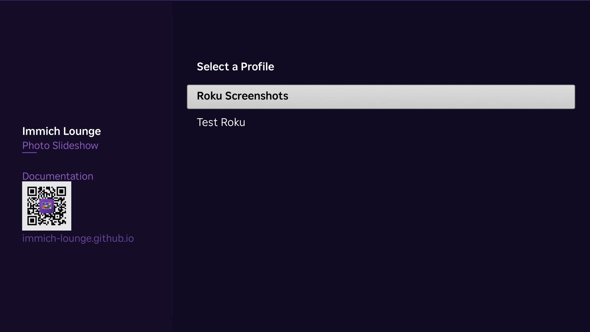

Immich Lounge is a Roku channel and screensaver for <a href="https://immich.app">immich</a>. It turns a Roku TV into a photo display with a small self-hosted companion for setup, profiles, and playlist building.

  <a class="md-button md-button--primary" href="./getting-started">Get started</a>
  <a class="md-button" href="./installation">Installation</a>
  <a class="md-button" href="https://github.com/immich-lounge/immich-lounge">GitHub</a>

Add the Roku apps to your account:

  <table class="roku-links-table">
    <thead>
      <tr>
        <th>App</th>
        <th>Channel Store</th>
        <th>Add Link</th>
      </tr>
    </thead>
    <tbody>
      <tr>
        <td>Immich Lounge</td>
        <td><a class="roku-link-pill" href="https://channelstore.roku.com/details/b07c35a07c79ab9a68c29c923ac481ce:bdf9083c719f8f235036b2c91bcef535/immich-lounge">Open in Store</a></td>
        <td><a class="roku-link-pill roku-link-pill-secondary" href="https://my.roku.com/account/add/immichlounge">Add to Account</a></td>
      </tr>
      <tr>
        <td>Immich Lounge Screensaver</td>
        <td><a class="roku-link-pill" href="https://channelstore.roku.com/details/1dbc550b0d535eebf60d6fc4b77ec0fb:a6fafa094f6a14e19c10f0bb1e06e315/immich-lounge-screensaver">Open in Store</a></td>
        <td><a class="roku-link-pill roku-link-pill-secondary" href="https://my.roku.com/account/add/immichloungesaver">Add to Account</a></td>
      </tr>
    </tbody>
  </table>

## Why People Use It

  

    <h3>Photo display on Roku</h3>
    
Use a Roku TV or streaming device as a full-screen slideshow for your own immich library.

  

  

    <h3>Separate channel and screensaver profiles</h3>
    
Keep one setup for normal playback and another for the Roku screensaver if you want different content.

  

  

    <h3>Simple LAN setup</h3>
    
The companion handles setup and playlists, while the Roku loads media directly from immich.

  

## Good Fits

Immich Lounge is a good fit when you already use immich, want a Roku-based slideshow, and prefer a simple local setup.

  

    <h3>Shared family TV</h3>
    
Turn a living room TV into a photo display when it is idle.

  

  

    <h3>Room-specific profiles</h3>
    
Use different albums, people, or memories in different rooms without running multiple companion services.

  

  

    <h3>Reliable fallback behavior</h3>
    
Cached profile and playlist data help playback continue when a service is temporarily unavailable.

  

## Features

  

    <h3>immich integration</h3>
    
Build slideshows from albums, people, tags, and memories in your own library.

  

  

    <h3>Companion web app</h3>
    
Create profiles, change display settings, and manage setup from a browser.

  

  

    <h3>Roku channel and screensaver</h3>
    
Use one profile for both, or keep them separate.

  

  

    <h3>Display controls</h3>
    
Choose transitions, photo motion, overlays, persistent clock and weather, and background effects.

  

## In Action

  <figure class="screenshot-card">
    
    <figcaption>Configure the companion with your immich server URL and API key.</figcaption>
  </figure>
  <figure class="screenshot-card">
    
    <figcaption>Slideshow playback with overlay, clock, and weather.</figcaption>
  </figure>
  <figure class="screenshot-card">
    
    <figcaption>Select a profile on the Roku after connecting to the companion.</figcaption>
  </figure>
  <figure class="screenshot-card">
    
    <figcaption>Refresh, switch profile, change companion, or clear cache from the Roku menu.</figcaption>
  </figure>

## Architecture Overview

  

    <h3>Browser</h3>
    
Use the companion web app to configure the immich connection and create slideshow profiles.

  

  

    <h3>Companion</h3>
    
Stores settings, serves the Roku setup flow, and builds playlists for the selected profile.

  

  

    <h3>Roku</h3>
    
Fetches the active profile and playlist, then loads media directly from immich.

  

  

    <h3>immich</h3>
    
Remains the source of truth for photos and most metadata.

  

## Requirements

| Component | Minimum Version |
|-----------|----------------|
| immich | v2.0 |
| Roku OS | 15.0 |
| Docker | 24.0 (for companion) |

## Quick Links

  <a class="quick-link" href="./getting-started">Getting Started</a>
  <a class="quick-link" href="./installation">Installation</a>
  <a class="quick-link" href="./configuration">Configuration</a>
  <a class="quick-link" href="./companion-app">Using the Companion</a>
  <a class="quick-link" href="./roku-apps">Using the Roku Apps</a>
  <a class="quick-link" href="./troubleshooting">Troubleshooting</a>
  <a class="quick-link" href="./support">Support</a>

