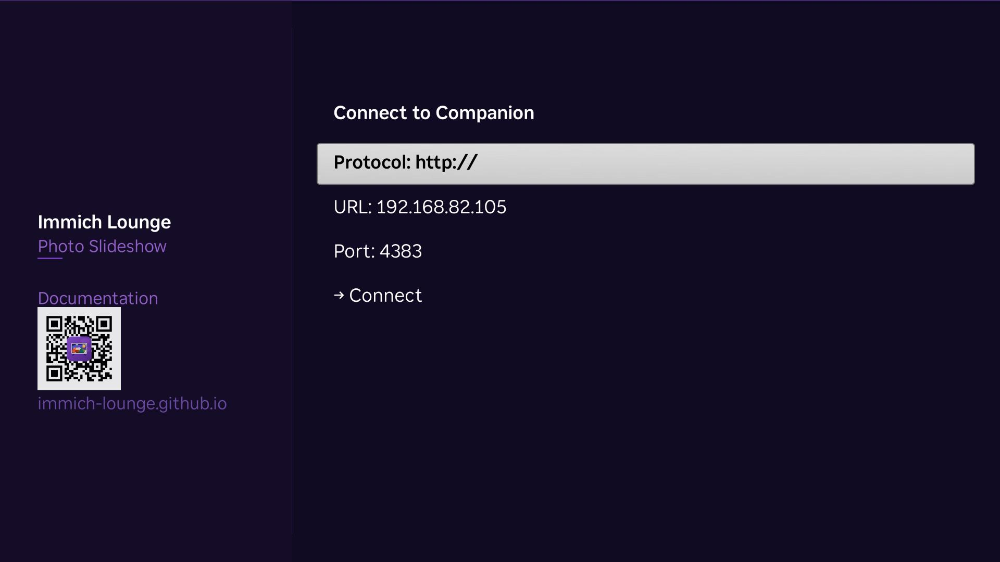

# Installation

## Companion

If you already run immich with Docker Compose, the simplest setup is to add one service to that existing compose file.

Use a normal Docker port mapping on `4383`. Do not expose the companion to the public internet.

## Preferred setup

- Add the service to your existing Immich `docker-compose.yml`.
- Keep the companion in the same trusted LAN as your Roku and immich server.
- Keep `/data` persisted with a Docker volume.

Reference file:
[docker-compose.yml](https://github.com/immich-lounge/immich-lounge/blob/master/docker-compose.yml)

Copy/paste snippet:

```yaml title="docker-compose.yml"
--8<-- "https://raw.githubusercontent.com/immich-lounge/immich-lounge/master/docker-compose.yml"
```

```bash
docker compose up -d
```

The companion stores settings, profiles, and cache data under `/data`.

To update later:

```bash
docker compose pull
docker compose up -d
```

## Roku apps

Immich Lounge is not published in the Roku Channel Store yet. Store submission is in progress and may take a little time.

If you want to try it before then, ask for a beta access code.

Install when available:

- **Immich Lounge**
- **Immich Lounge Screensaver**

The channel handles normal playback. The screensaver is configured from Roku system settings.

## First Roku setup

Open **Immich Lounge** on Roku and enter the companion URL:

```text
http://192.168.1.10:4383
```

Then choose a profile.

{ .doc-screenshot }
<p class="doc-caption">Manual companion setup on Roku uses the companion host and port <code>4383</code>.</p>

## Screensaver setup

Go to Roku Settings, choose **Immich Lounge Screensaver**, then open **Configure Screensaver**.

The screensaver can share the same companion URL and use either the same or a different profile.

## Network notes

You usually only need two paths to work:

- Roku to companion on port `4383`
- Roku to immich on your immich server port, usually `2283`

The Roku fetches media and most metadata directly from immich. The companion is not a media proxy.
